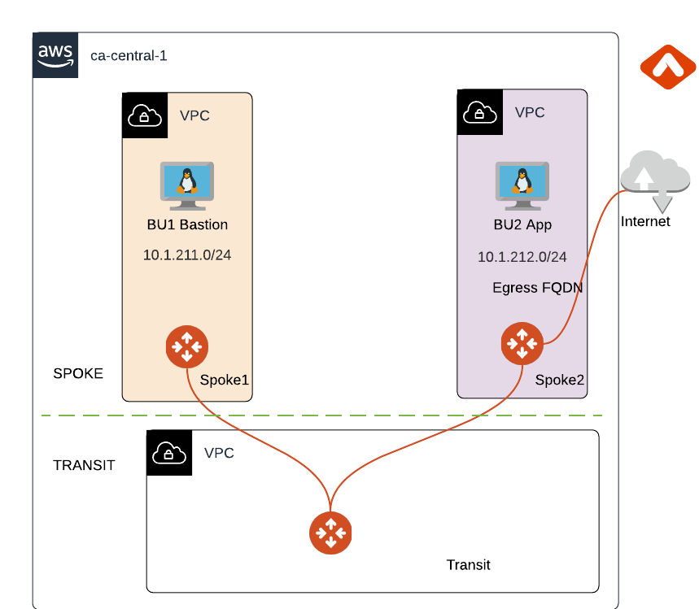

# ace-iac-day-zero (Lab 1 and Lab 2)

This repository builds out the following infrastructure for the Aviatrix ACE IaC course:

- Aviatrix Transit in AWS
- Aviatrix Spoke in AWS
- Aviatrix Spoke in Azure
- Ubuntu VMs with password authentication (1 per spoke)
- Multi-Cloud Segmentation (2 security domains)

Component | Version
--- | ---
Aviatrix Controller | UserConnect-6.6.5545 (6.6)
Aviatrix Terraform Provider | > 2.21
Terraform | > 1.1.0
AWS Terraform Provider | > 3.0
Azure Terraform Provider | > 3.0.0

### Dependencies

- Software version requirements met
- Aviatrix Controller with Access Accounts defined for AWS
- Sufficient AWS EIPs for region in scope
- Account credentials for AWS defined in environment. The following environment variables will be needed:
  - AWS_ACCESS_KEY_ID
  - AWS_SECRET_ACCESS_KEY
  - TF_VAR_azure_subscription_id
  - TF_VAR_azure_tenant_id
  - TF_VAR_azure_client_id
  - TF_VAR_azure_client_secret 

